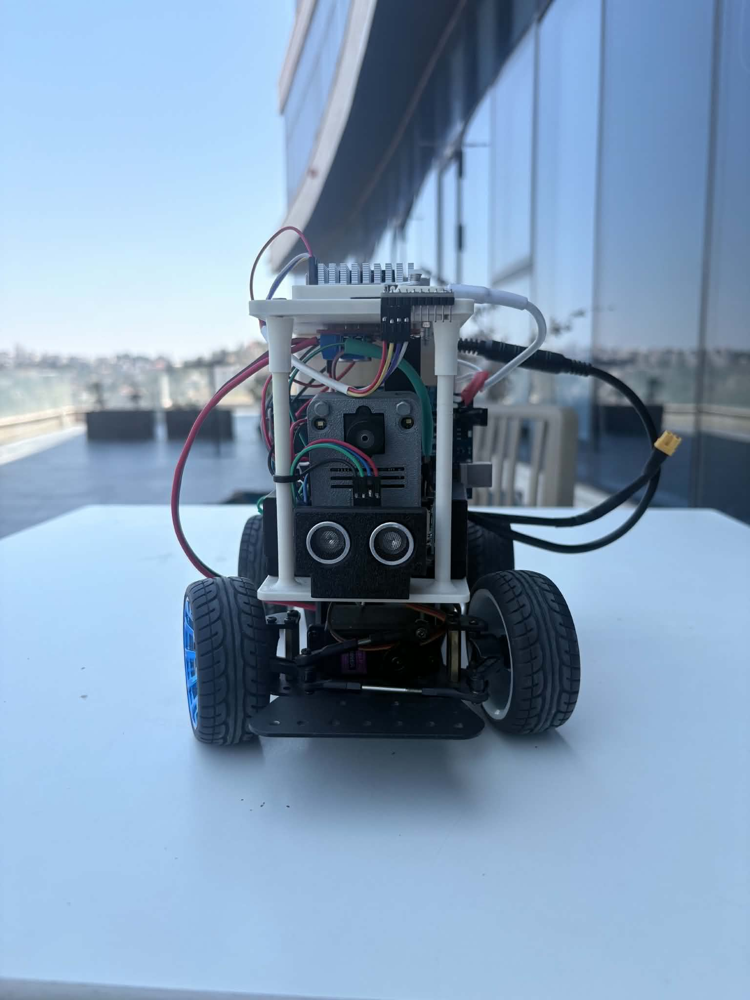
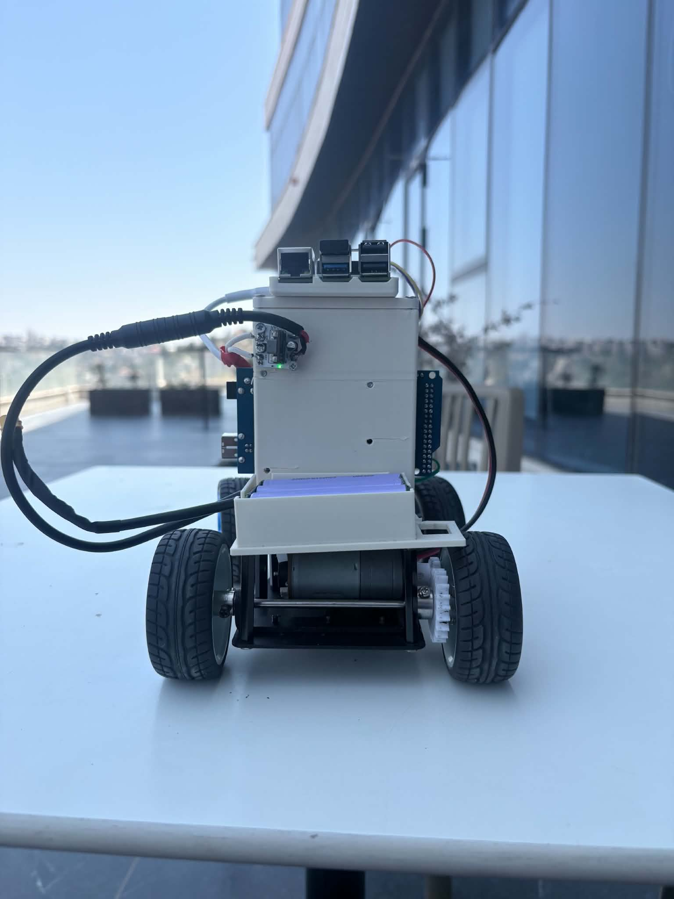
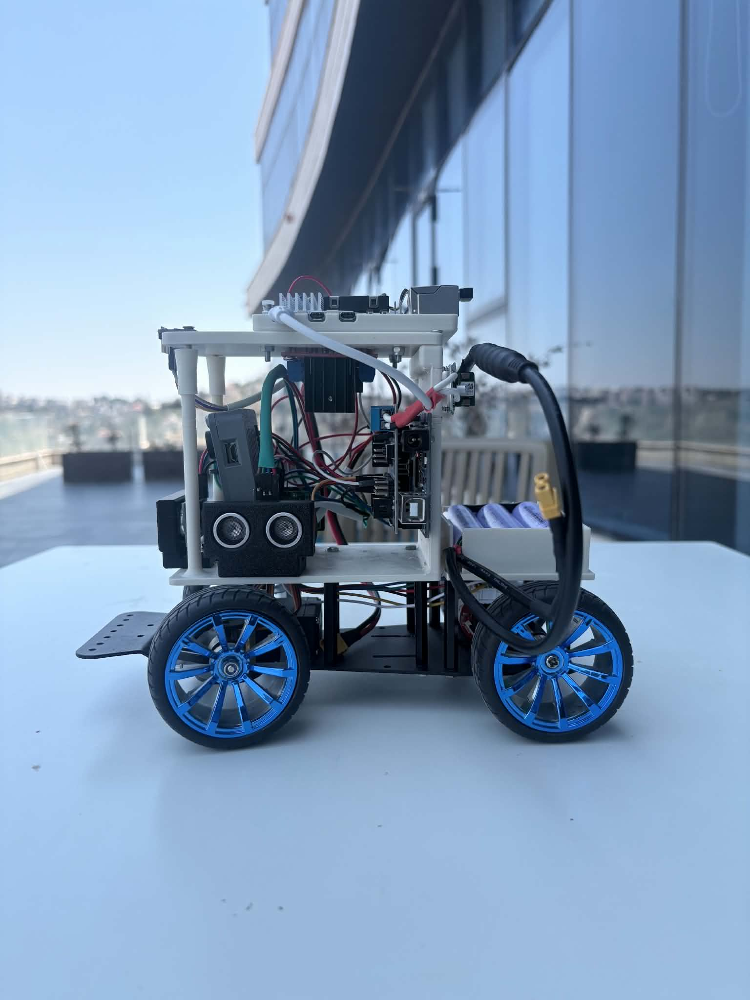
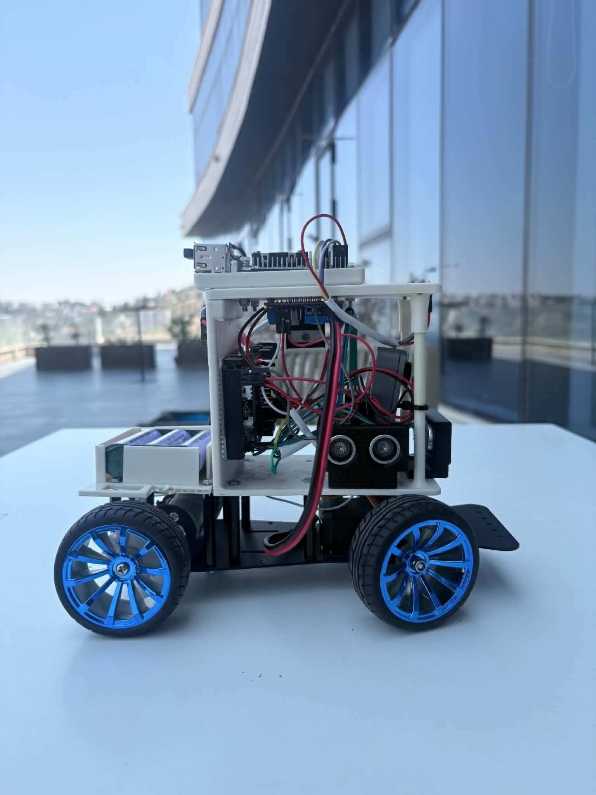
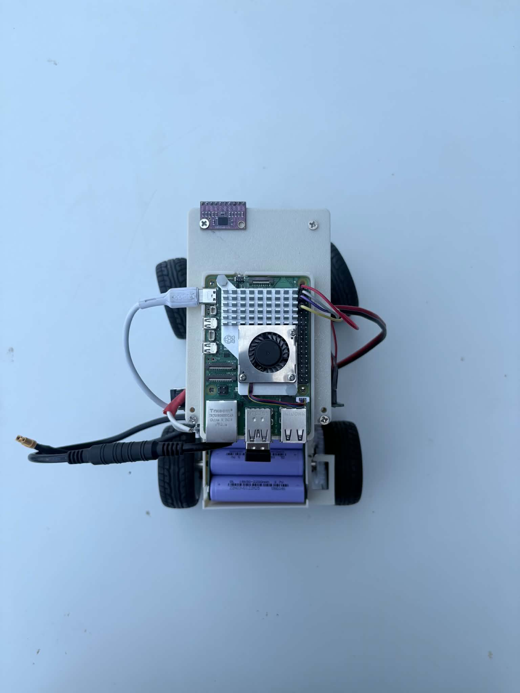
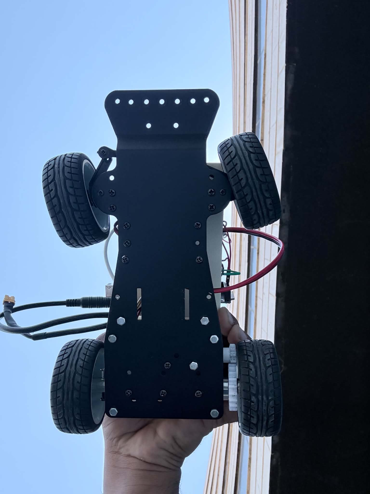

**Official documentation for 7sm**

[Watch Demo](#performance-video) • [Documentation](#table-of-contents) • [Build Guide](#robot-construction-guide) 

---

## Table of Contents
* [The Team](#team)
* [The Challenge](#challenge)
* [The Robot](#robot-image)
* [Mobility Management](#mobility-management)
  * [Powertrain](#powertrain-mechanical)
    * [Drivetrain](#drivetrain-mechanical)
    * [Motor](#motor-mechanical)
    * [Motor Driver](#motor-driver-mechanical)
  * [Steering](#steering-mechanical)
    * [Servo Motor](#servo-motor)
  * [Chassis](#chassis-mechanical)
* [Power and Sense Management](#power-and-sense-management)
  * [Power Supply](#power-supply)
  * [Arduino Mega](#arduino-mega)
  * [bno080](#bno080)
  * [us100](#us100)
  * [Pixy2](#pixy2)
  * [Circuit Diagram](#circuit-diagram)
* [Robot Construction Guide](#robot-construction-guide)
  * [Step 1: Print the 3D parts](#3d-printing)
  * [Step 2: Assemble the steering system](#steering-system-assembly)
  * [Step 3: Attach the wheels](#wheel-attachment)
* [Cost Report](#cost-report)
  * [3D Printing Costs](#3d-printing-costs)
  * [components costs](#components-costs)
* [License](#License)

---

## The Team 

<tr>
<td align="center" width="50%">
</td>

<td align="center" width="50%">
<h3>Othman Jaber</h3>

 <b>Age:</b> 16
 
<b>Email:</b> othmanjaber78@gmail.com

<b>School:</b>King Talal Secondary School

<b>GitHub:</b> <a href="https://github.com/othmanjaber">othmanjaber</a>
  
 <h3>
</td>

---

<td align="center" width="50%">
<h3>Rayan Rinno</h3>

 <b>Age:</b> 14
 
<b>Email:</b> rinoorayan14@gmail.com

<b>School:</b> British Scientific School

<b>GitHub:</b> <a href="https://github.com/rayanrinoo">rayanrinoo</a>
  
 <h3>
</td>

---

<td align="center" width="50%">

<h3>Yazan Hindia</h3>

 <b>Age:</b> 14
 
<b>Email:</b> yazanhindia@gmail.com

<b>School:</b> Mahmoud Darwish School 

<b>GitHub:</b> <a href="https://github.com/kdo3l">Yazan Hindia</a>
  
 <h3>

## The Challenge 

The **[WRO 2026 Future Engineers - Self-Driving Cars](https://wro-association.org/)** challenge invites teams to design, build, and program a robotic vehicle capable of driving autonomously on a racetrack that changes dynamically for each round. The competition includes two main tasks: completing laps while navigating randomized obstacles and successfully performing a precise parallel parking maneuver. Teams must integrate advanced robotics concepts such as computer vision, sensor fusion, and kinematics, focusing on innovation and reliability.

Learn more about the challenge [here](https://wro-association.org/wp-content/uploads/WRO-2026-Future-Engineers-Self-Driving-Cars-General-Rules.pdf).

## Our Robot 

Here are some pictures of our robot from every side:
<table>
<tr>
<td align="center"> <b>Front</b></td>
<td align="center"> <b>Back</b></td>
<td align="center"> <b>Left</b></td>
</tr>
<tr>
<td align="center"> <b>Right</b></td>
<td align="center"> <b>Top</b></td>
<td align="center"> <b>Bottom</b></td>
</tr>
</table>

# Mobility Management 

The robot's mobility is managed by a combination of components, including the powertrain, steering system, and chassis. These elements work together to ensure the robot's smooth and efficient movement.

## Powertrain 

### Drivetrain 

Our drivetrain uses a DC motor that transfers power to the rear axle through an external gear system. This gear arrangement reduces the rotational speed while increasing the available torque, providing smooth and reliable movement. The rear wheels are mounted on a common axle for synchronized rotation, while the front wheels are mounted independently and connected to the steering mechanism. This design offers a good balance between simplicity, durability, and driving performance.

**Potential Improvements**:
- Add a differential system for smoother turning
- Implement encoder feedback for precise distance measurement
- Consider gear reduction for better torque control

### Motor 

<table>
  <tr>
    <td width="50%" style="text-align: left;">
      
    </td>
    <td width="50%" style="text-align: left; vertical-align: top;">
      <h3>Specifications:</h3>
      <li>Voltage: 12V</li>
      <li>Current: 0.4-1 A no load, 3.2A stall</li>
      <li>Speed: ~130 RPM at 12v</li>
      <li>Torque: ~4.4-8 kg.cm</li>
      <li>Weight: 55g</li>
    </td>
  </tr>
</table>

A standard DC gearmotor was selected for its simplicity, reliability, and ability to provide the required torque. The drivetrain uses a simple two-gear transmission, where the first gear is connected to the motor shaft and drives the second gear mounted on the axle. This design efficiently transfers power while maintaining a compact and reliable mechanical structure.

**Potential Improvements**:
- Add encoder for precise speed and position control
- Implement better motor mounting for reduced vibration
- Consider brushless motor for higher efficiency

### Motor Driver 

<table>
  <tr>
    <td width="50%" style="text-align: left;">
      
    </td>
    <td width="50%" style="text-align: left; vertical-align: top;">
      <h3>Specifications:</h3>
      <li>Power supply voltage: 5V-35V</li>
      <li>Output current: 2A per channel (4A peak)</li>
      <li>Built-in 5V regulator</li>
      <li>Direction and PWM speed control</li>
      <li>Heat sink for thermal protection</li>
    </td>
  </tr>
</table>

We use the L298N motor driver to control both the drive motor and servo motor. This dual H-bridge driver allows precise control of motor direction and speed through PWM signals from the Arduino.

**Potential Improvements**:
- Add current sensing for motor feedback
- Implement better heat dissipation
- Use more efficient motor driver with lower voltage drop

to mount the motor driver we made this 3d design: 

## Steering 

Our steering system uses an Ackermann steering mechanism for improved turning performance. The front wheels are controlled by a servo motor connected through a mechanical linkage designed to provide different steering angles for the inner and outer wheels during a turn. This reduces tire slipping and allows the robot to follow smoother and more accurate turning paths.

**Potential Improvements**:
- Use stronger servo for more precise control

### Servo Motor 

<table>
  <tr>
    <td width="50%" style="text-align: left;">
      
    </td>
    <td width="50%" style="text-align: left; vertical-align: top;">
      <h3>Specifications:</h3>
      <li>Weight: 55g</li>
      <li>Stall torque: 9.4 kgf·cm (4.8V ), 11 kgf·cm (6 V)</li>
      <li>Operating speed: 0.17 s/60º (4.8 V), 0.14 s/60º (6 V)</li>
      <li>Rotation angle: 180 degrees</li>
    </td>
  </tr>
</table>

We selected the MG996R servo motor for steering control due to its high torque and durability. The servo provides sufficient power to accurately control the Ackermann steering mechanism, ensuring smooth and precise wheel movement during direction changes.

## Chassis 

Our chassis is built using 3D printed components, designed to be lightweight yet sturdy. The chassis houses all electronic components and provides mounting points for motors, sensors, and other hardware.

The design prioritizes:
- Low center of gravity for stability
- Easy access to components for maintenance
- Proper weight distribution
- Compact form factor

# Power and Sense Management 

The robot's power and sensor management system consists of several components working together to provide reliable power and accurate environmental sensing.

### Power Supply 

<table>
  <tr>
    <td width="50%" style="text-align: left;">
      
    </td>
    <td width="50%" style="text-align: left; vertical-align: top;">
      <h3>Specifications:</h3>
      <li>Type: Li-Po or NiMH battery pack</li>
      <li>Voltage: 7.4V-9V</li>
      <li>Capacity: 2000-3000mAh</li>
      <li>Discharge rate: 10C-20C</li>
    </td>
  </tr>
</table>

Our power system uses a rechargeable battery pack to provide clean, stable power to all components. The L298N driver includes a built-in 5V regulator to power the Arduino and sensors.

**Potential Improvements**:
- Add battery voltage monitoring
- Implement low battery warning system
- Use higher capacity battery for longer runtime

### Arduino Mega 

<table>
  <tr>
    <td width="50%" style="text-align: left;">
      
    </td>
    <td width="50%" style="text-align: left; vertical-align: top;">
      <h3>Specifications:</h3>
      <li>Microcontroller: ATmega2560</li>
      <li>Flash memory: 256KB</li>
      <li>SRAM: 8KB</li>
      <li>EEPROM: 4KB</li>
      <li>Frequency: 16MHz</li>
      <li>Digital pins: 54</li>
      <li>Analog pins: 16</li>
      <li>Input voltage: 5V</li>
    </td>
  </tr>
</table>

The Arduino Mega serves as the main controller for our robot, managing all sensors and actuators. Its simplicity and extensive library support make it ideal for this application.

**Potential Improvements**:
- Upgrade to faster microcontroller for better performance
- Add external EEPROM for data logging
- Implement wireless communication capabilities

### BNO080 

<table>
  <tr>
    <td width="50%" style="text-align: left;">
      
    </td>
    <td width="50%" style="text-align: left; vertical-align: top;">
      <h3>Specifications:</h3>
      <li>Motion sensing: 3-axis gyroscope + 3-axis accelerometer + 3-axis magnetometer</li>
      <li>Processor: Integrated ARM Cortex-M0+ sensor hub</li>
      <li>Interface: I2C, SPI, UART</li>
      <li>Operating voltage: 1.7V to 3.6V</li>
      <li>Current consumption: ~3.8mA</li>
      <li>Output: Rotation vector, quaternion, Euler angles</li>
    </td>
  </tr>
</table>

The BNO080 is a 9-axis absolute orientation sensor that combines a 3-axis gyroscope, 3-axis accelerometer, and 3-axis magnetometer with an integrated motion processor. It provides accurate orientation data and sensor fusion internally, making it suitable for maintaining straight-line movement and improving turning accuracy.

**Potential Improvements**:
- Calibrate the sensor regularly to reduce drift
- Combine IMU data with wheel encoders for more accurate position tracking

### US100 

<table>
  <tr>
    <td width="50%" style="text-align: left;">
      
    </td>
    <td width="50%" style="text-align: left; vertical-align: top;">
      <h3>Specifications:</h3>
      <li>Measurement range: 20mm to 4500mm</li>
      <li>Accuracy: ±10mm</li>
      <li>Interface: UART / Trigger-Echo</li>
      <li>Supply voltage: 3.0V to 5.5V</li>
      <li>Operating frequency: 40kHz</li>
      <li>Current consumption: <20mA</li>
    </td>
  </tr>
</table>

The US100 ultrasonic sensor uses sound waves to measure distance by calculating the time taken for the echo to return. It provides reliable obstacle detection and distance measurement, making it useful for robot navigation and avoiding collisions.

**Potential Improvements**:
- Apply filtering algorithms to reduce measurement noise
- Combine ultrasonic data with IMU and encoder feedback for improved navigation accuracy

### Pixy2 

<table>
  <tr>
    <td width="50%" style="text-align: left;">
      
    </td>
    <td width="50%" style="text-align: left; vertical-align: top;">
      <h3>Specifications:</h3>
      <li>Processor: NXP LPC4330 204 MHz dual core</li>
      <li>Image sensor: Aptina MT9M114</li>
      <li>Resolution: 1296×976</li>
      <li>Frame rate: 60 fps</li>
      <li>Interface: SPI, I2C, UART, USB</li>
      <li>Power consumption: 140 mA typical</li>
    </td>
  </tr>
</table>

The Pixy2 camera provides advanced computer vision capabilities for color detection and object tracking. It can detect colored objects, lines, and even perform simple AI tasks.

**Potential Improvements**:
- Train custom models for specific object detection
- Implement line following algorithms
- Add better mounting for stable image capture

### Circuit Diagram 

